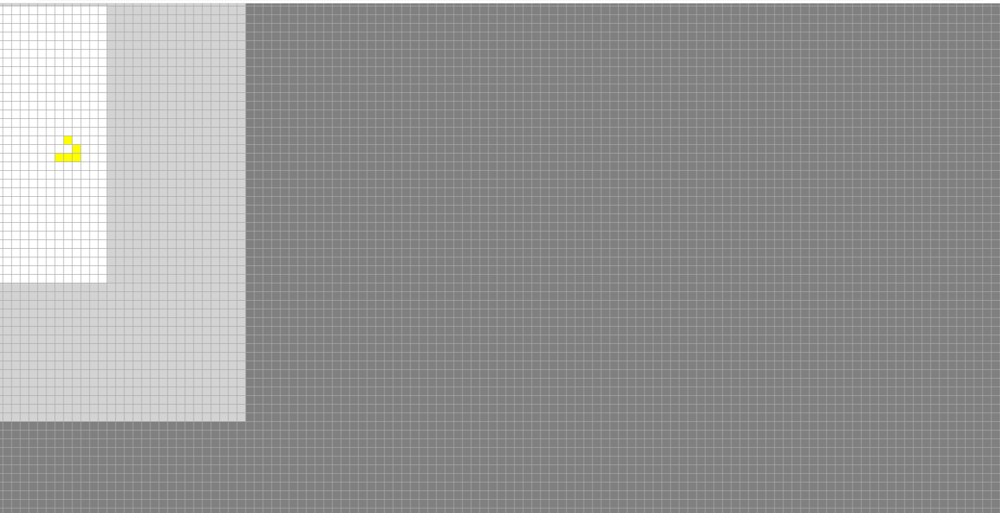
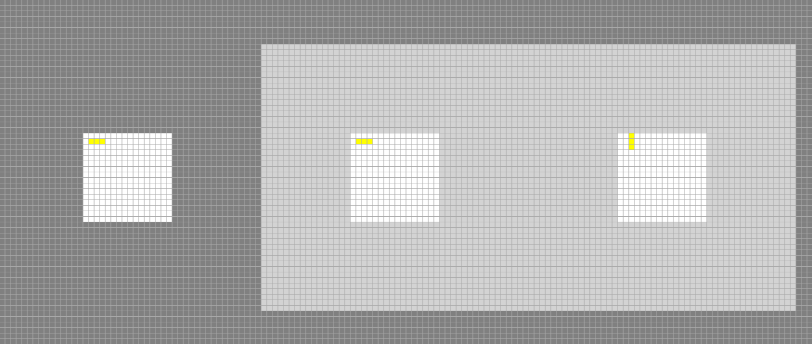
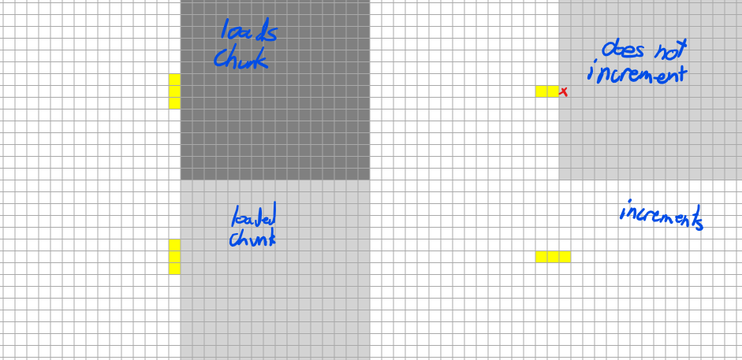
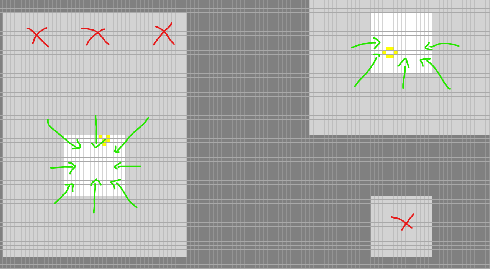

# ChunkAutomata
Cellular Automata implementation featuring a chunk-based loading system in a (potentially) infinite world in Javascript.
Code in src folder with sample index.html.

## Implementation
An instance is created with `new Automaton(rule, chunksize)` where
- `rule` is a function that determines a given cell's next state. It takes an array of cell states containing that cell and the 8 neighbors in row-major order, starting at the bottom left. The neighborhood surrounding the cell (`neighborhood[4]`) is specified by the table below.

|                 |                 |                 |
| --------------- | --------------- | ----------------|
| `neighborhood[6]` | `neighborhood[7]` | `neighborhood[8]` |
| `neighborhood[3]` | `neighborhood[4]` | `neighborhood[5]` |
| `neighborhood[0]` | `neighborhood[1]` | `neighborhood[2]` |

- `chunksize` is the side-length of a single chunk.

The automation is incremented with the `step()` function, which has an optional count parameter.
Individual cells can be modified with `getCell(x,y)` and `setCell(x,y, state)`. The passed locations are the cell coordinates, hiding the chunking feature behind a layer of abstraction.

`automaton.loadedChunks` holds all the cell information. This can be accessed manually, where each chunk is held in a property specified by an array, `[x,y]`. This is equivalent to the string `"x,y"`. Otherwise, the function `getChunk(x,y)` can be used.
```javascript
getChunk(x, y){
    var coords = [x,y];
    return this.loadedChunks[coords];
}
```

A sample implementation can be found in src's index.html. Use WASD to move, and E to advance the automaton.
### Chunks
Each chunk holds the states of each local cell in an array for the current and next iteration. Each chunk is either
- ***unloaded***, where the automaton doesn't consider it to exist, and it is not in memory.
- ***empty***, where the chunk is loaded, but is not normally iterated (only the boundary cells are considered in the step). Every cell of an empty chunk has a null state.
- ***loaded***, where the chunk is treated as normal.

Every loaded chunk is in a dictionary, `loadedChunks`, and *either is empty or has all of its neighbors loaded*. The idea here is that every chunk that has activity needs it and the surrounding chunks loaded, creating a buffer zone between active and unloaded chunks.<br/>
<br/>
This means that stepping through iterations can rougly go as follows in broken ~~engli~~ pseudoco
```
foreach chunk in loadedChunks:
    if(chunk.isEmpty)
        foreach direction:
            if(chunkInDirection.isLoaded)
                if(chunkInDirection.isEmpty)
                    foreach cell in chunk.border(direction):
                        nextcell = rule(cellAndNeighborsCurrentState);
        if(noneWereLoaded())
            unload(chunk)
    else
        foreach direction:
            if(!chunkInDirection.isLoaded)
                load(chunkInDirection)
        foreach cell in chunk:
            nextcell = rule(cellAndNeighborsCurrentState);
foreach chunk in loadedChunks:
    chunk.setAllNextCellsToCurrent();
```
For the sake of example, we'll use Conway's Game of Life:
```javascript
//null: dead, 1: alive
    function rule(neighbors){
        //count neighbors
        var i = (neighbors[0] == null)? 0 : 1;
        i += (neighbors[1] == null)? 0 : 1;
        i += (neighbors[2] == null)? 0 : 1;
        i += (neighbors[3] == null)? 0 : 1;
        i += (neighbors[5] == null)? 0 : 1;
        i += (neighbors[6] == null)? 0 : 1;
        i += (neighbors[7] == null)? 0 : 1;
        i += (neighbors[8] == null)? 0 : 1;
        /*
          if alive, look for 2-3, if dead, look for 3
          
          simplify by ORing with cell state, sending
          the last bit high if alive, so we only need
          to check if i == 3.
        */
        i |= (neighbors[4] == null)? 0 : 1;
        return (i == 3)? 1 : null;
    }
```
How do we know when to load or unload a chunk?

This implementation loads all chunks around a non-empty chunk when handling the next iteration. This way, no logic is performed in a non-empty chunk without ensuring that the surrounding chunks are loaded.<br/>
<br/>
In the image above, the 1x3 was initially placed and `step()` is about to be called. Then, inside `step`, the surrounding cells are loaded before proceeding with calculating the next state.

There's a problem here though.<br/>
Consider the case where a new chunk is loaded. Whether or not that new chunk is incremented is entirely dependent on the iterator of `loadedChunks`. There is a chance that the chunk is loaded, but the iterator does not increment it. This is because we modified `loadedChunks` while iterating, and Javascript does not handle that very well.<br/>
*To be fair, concurrency is not handled very well in general.*
<br/>
We fix this by adding a second dictionary to buffer the newly born chunks, adding to that dictionary instead of to the main one. We can then increment each chunk in the second dictionary before adding it to the original. *We don't have to do this more than once, because the logic for an empty chunk is different from a nonempty one. Empty chunks **will not** load new chunks.*

We handle unloading in a similar way to garbage collection. Only nonempty cells actively consult their neighbors (empty cells perform a check first, to see if it should consult its neighbor). This means that for each empty cell, we can check if it has an empty neighbor and only keep it if it does.<br/>
<br/>
